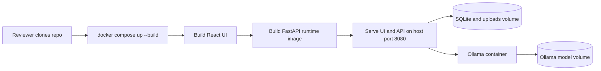

# Story Release: Docker Reviewer Package

**GitHub issue:** #TBD

**Status:** In Progress

**Owner:** Vipin

**Epic:** Demo readiness
**Last updated:** 2026-08-31

## 1. Outcome

### User-Visible Goal

A reviewer can download the repository, run the Call Center Radar POC with Docker Compose, and use the app from a single local URL without installing Python, Node, FFmpeg, or Ollama directly on their machine.

### Scope

- Included: Docker image, Docker Compose setup, FastAPI static frontend serving, Docker-specific persistent volumes, health check, reviewer instructions, and focused tests.
- Excluded: cloud deployment, production hardening, GPU-specific images, automated release publishing from CI, and replacing SQLite.

### Acceptance Criteria

- [x] A reviewer can build the app image from the repository.
- [x] A reviewer can run the app with `docker compose up --build`.
- [x] The React UI and API are available from one container URL.
- [x] SQLite data, uploads, Whisper cache, and Ollama model files persist in Docker volumes.
- [x] README explains setup, model pull, health checks, and reset.

## 2. Design

### Flow

### Components and Ownership

| Area | Files or module | Responsibility |
| --- | --- | --- |
| Docker | `Dockerfile`, `docker-compose.yml`, `.dockerignore` | Build and run the reviewer package. |
| API | `apps/api/src/app/main.py`, `apps/api/src/app/config.py` | Serve built web assets when `CALL_RADAR_STATIC_DIR` is configured. |
| Documentation | `README.md`, this story record | Explain reviewer setup and operational behavior. |
| Tests | `apps/api/tests/test_main.py` | Protect static frontend serving behavior. |

### Contracts and Data

The API contract is unchanged. New optional environment variable `CALL_RADAR_STATIC_DIR` tells the API to serve a built React app from that directory. Docker Compose maps SQLite data and uploads to `call-radar-data`, Whisper cache to `call-radar-whisper-cache`, and Ollama models to `call-radar-ollama`.

## 3. Operational Behavior

### Logging and Privacy

No new application log fields are added. Existing privacy rules remain: raw audio, transcript text, metadata payloads, participant names, and secrets are not logged. Docker logs show application lifecycle and API request summaries only.

### Failure and Recovery

If Docker build fails, the likely cause is dependency download/network failure. If LLM analysis is unavailable, run `docker compose up -d ollama` followed by `docker compose run --rm ollama-model`. If demo data needs a clean reset, run `docker compose down -v` to delete Docker volumes.

## 4. Verification

### Automated Tests

| Check | Result | Notes |
| --- | --- | --- |
| Unit tests | Passed | `npm run test`: 46 web tests and 110 API tests passed. |
| Coverage | Passed | `npm run test:coverage`: web coverage completed; API coverage reported 92% overall. |
| Integration tests | Passed | `docker compose build app`; `docker compose config --quiet`; `docker compose up -d app`; container health check passed; host `http://127.0.0.1:8080/api/health` and inside-container `/api/health` returned `{"status":"ok","database":"reachable"}`. |
| Lint and format | Passed | `npm run lint`; `npm run format:check`. |
| Build | Passed | `npm run build`; Docker image build produced `call-center-radar:poc`. |
| Accuracy evaluation | Not applicable | Packaging story only; model behavior is unchanged. |

### Manual Verification and Demo Path

1. Run `docker compose up --build`.
2. Open `http://localhost:8080`.
3. Run `curl http://localhost:8080/api/health`.
4. Run `docker compose up -d ollama` and `docker compose run --rm ollama-model` once for local LLM analysis.
5. Upload one audio/metadata pair and confirm processing starts.

### Known Gaps and Follow-Up Boundaries

- The default image is CPU-oriented and may process audio slowly on small laptops.
- The Ollama model is pulled at runtime through a setup profile, not embedded in the image, to keep the release artifact smaller.
- This is a local reviewer package, not a production deployment topology.

## 5. Delivery Record

- Branch: `codex/docker-reviewer-release`
- Pull request: [#118](https://github.com/vrize-poc-demo/call-center-radar/pull/118)
- Commit(s): `6c15666`
- Review result: Pending

### Change Log

Update this table before every commit. Explain both the change and its reason; do not use generic entries such as "updates" or "fixes".

| Commit | What changed | Why |
| --- | --- | --- |
| Pending | Added Docker image, Compose topology, static frontend serving, README instructions, and story notes. | Let reviewers run the complete local POC consistently from a GitHub release. |
| Pending | Changed the default reviewer host port from 8000 to 8080. | Avoid collisions with the normal local API server and make Docker startup more reliable for reviewers. |

### PR Readiness and Review

- Mergeability verification: `Pending - npm run pr:verify -- <pr-number>`
- Code quality grade: `Pending - A to F`
- Testing quality grade: `Pending - A to F`
- Review findings and follow-up: Pending full local quality-gate and Docker verification.
