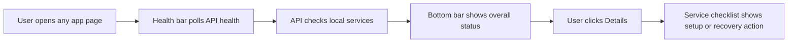

# Story: Service Health Status Bar

**GitHub issue:** #TBD

**Status:** In Progress

**Owner:** Vipin

**Epic:** Demo readiness
**Last updated:** 2026-08-31

## 1. Outcome

### User-Visible Goal

A manager or reviewer can always see whether the POC is healthy from a bottom status bar. Clicking the bar opens a simple service checklist that explains whether the API, SQLite, processing worker, transcription runtime, Ollama server, and configured LLM model are ready.

### Scope

- Included: detailed `/api/health` service report, processing-worker running signal, bottom UI status bar, expandable service details, setup guidance for missing services, and focused unit tests.
- Excluded: browser-triggered shell commands, automatic local process startup, cloud health monitoring, and production observability dashboards.

### Acceptance Criteria

- [x] A visible status bar appears at the bottom of every app page.
- [x] The compact bar shows healthy, degraded, or unhealthy state in plain language.
- [x] Clicking the bar shows each service with its status and recovery guidance.
- [x] Missing Ollama or missing configured model is visible before the user starts analysis.
- [x] The UI gives setup instructions instead of hiding failures in browser console logs.

## 2. Design

### Flow



### Components and Ownership

| Area | Files or module | Responsibility |
| --- | --- | --- |
| UI | `apps/web/src/features/health/ServiceHealthStatusBar.tsx` | Poll health and show bottom status bar plus service details. |
| UI API | `apps/web/src/api/calls.ts` | Define service health types and call `/api/health`. |
| Styling | `apps/web/src/styles.css` | Keep health bar fixed, readable, and responsive. |
| API | `apps/api/src/app/service_health.py`, `apps/api/src/app/main.py` | Build the detailed service report and expose it from `/api/health`. |
| Worker | `apps/api/src/app/worker.py` | Expose a read-only `is_running` property for health reporting. |
| Tests | `apps/api/tests/test_main.py`, `apps/web/src/features/health/ServiceHealthStatusBar.test.tsx` | Protect service-health contract and user-facing behavior. |

### Contracts and Data

`GET /api/health` now returns:

```json
{
  "status": "healthy | degraded | unhealthy",
  "services": [
    {
      "key": "database",
      "label": "SQLite data store",
      "status": "healthy",
      "detail": "SQLite is reachable and ready to persist calls.",
      "action_label": null,
      "action_hint": null
    }
  ]
}
```

No database schema changes are required. The endpoint checks configuration values such as `CALL_RADAR_PROCESSING_WORKER_ENABLED`, `CALL_RADAR_OLLAMA_BASE_URL`, and `CALL_RADAR_OLLAMA_MODEL`.

## 3. Operational Behavior

### Logging and Privacy

No raw audio, transcript text, customer PII, metadata payloads, or secrets are logged. The browser logs only `service_health_poll_failed` when the health endpoint is unreachable. Existing API request logging records method, path, status code, and request ID only.

### Failure and Recovery

If the API is unreachable, the bar shows `Not healthy` and tells the user to start the backend. If SQLite is unreachable, the whole report becomes unhealthy. If the worker is disabled or the configured Ollama model is missing, the report becomes degraded and shows the exact setup command or environment change needed.

## 4. Verification

### Automated Tests

| Check | Result | Notes |
| --- | --- | --- |
| Unit tests | Passed | `npm run test`: 49 web tests and 111 API tests passed. |
| Integration tests | Passed | Local API on `8003` returned a full healthy service report; web on `5174` served the app pointed at that API. |
| Lint and format | Passed | `npm run lint`; `npm run format:check`. |
| Build | Passed | `npm run build`. |
| Coverage | Passed | `npm run test:coverage`: health UI covered; API coverage reported 92% overall. |
| Accuracy evaluation | Not applicable | This story reports runtime health only; analysis quality is unchanged. |

### Manual Verification and Demo Path

1. Started API on `http://127.0.0.1:8003` with `CALL_RADAR_PROCESSING_WORKER_ENABLED=true`.
2. Started web on `http://127.0.0.1:5174` with `VITE_API_BASE_URL=http://127.0.0.1:8003`.
3. Confirmed `curl http://127.0.0.1:8003/api/health` reports database, worker, transcription runtime, Ollama server, and analysis model as healthy.
4. Opened `http://127.0.0.1:5174/` for manual browser review of the bottom status bar.
5. Missing-model and API-unreachable states are covered by React unit tests.

### Known Gaps and Follow-Up Boundaries

- The browser does not start local services directly; it displays safe setup commands for the reviewer/developer.
- Ollama model download can still take time and depends on network availability.
- The check verifies that dependencies exist and services respond; it does not run a full sample audio transcription.

## 5. Delivery Record

- Branch: `codex/service-health-status`
- Pull request: [#119](https://github.com/vrize-poc-demo/call-center-radar/pull/119)
- Commit(s): `33e6128`
- Review result: TBD

### Change Log

Update this table before every commit. Explain both the change and its reason; do not use generic entries such as "updates" or "fixes".

| Commit | What changed | Why |
| --- | --- | --- |
| Pending | Added detailed API health checks, bottom health bar UI, setup guidance, and focused tests. | Let reviewers quickly see whether the full local POC stack is ready before processing calls or running LLM analysis. |

### PR Readiness and Review

- Mergeability verification: `Pending - npm run pr:verify -- <pr-number>`
- Code quality grade: `Pending - A to F`
- Testing quality grade: `Pending - A to F`
- Review findings and follow-up: Pending full local quality gate.
