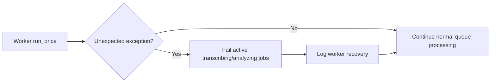

# Story: Worker queue resilience

**GitHub issue:** #TBD

**Status:** In Progress

**Owner:** SusmithaKM / Codex

**Epic:** Operational reliability
**Last updated:** 2026-08-24

## 1. Outcome

### User-Visible Goal

Uploaded calls should not remain stuck in `Queued` because one unexpected local worker error stopped the background processor. The local queue should keep consuming later jobs and should expose failed processing attempts as terminal failures instead of silently hanging.

### Scope

- Included:
  - Catch unexpected exceptions in the durable processing worker loop.
  - Mark interrupted `transcribing` or `analyzing` jobs as `failed` with `worker_error` after an unexpected worker-loop error.
  - Log worker recovery and failed interrupted jobs without call transcript or audio content.
  - Add regression tests for failure marking and worker-loop recovery.
- Excluded:
  - Changing transcription model quality or speed.
  - Adding live-call ingestion.
  - Changing dashboard card calculations.

### Acceptance Criteria

- [x] A worker exception does not terminate the background queue consumer.
- [x] Jobs interrupted by an unexpected worker error are moved to `failed` with a diagnostic reason.
- [x] Later queued jobs can still be processed after a worker-loop exception.
- [x] Failure and recovery events are logged without raw audio, transcript text, or customer PII.

## 2. Design

### Flow

### Components and Ownership

| Area | Files or module | Responsibility |
| --- | --- | --- |
| UI | Not applicable | Queue UI already reflects `failed` and `completed` status from the API. |
| API | `apps/api/src/app/worker.py` | Keep the durable worker alive after unexpected processing errors. |
| Persistence | `processing_jobs`, `processing_job_events` | Store terminal `failed` status and audit transition reason `worker_error`. |
| Tests | `apps/api/tests/test_pipeline.py` | Prove interrupted work fails cleanly and the worker loop survives an exception. |

### Contracts and Data

No API request or response shape changed. No database migration is required. Existing `processing_jobs.failure_reason` stores `worker_error`, and existing `processing_job_events.reason` records the transition.

## 3. Operational Behavior

### Logging and Privacy

New/updated events:

- `processing_failed_after_worker_error` logs `job_id`, prior status, and failure reason.
- `processing_worker_error` logs exception type and count of interrupted jobs failed. Raw exception messages are not logged to avoid leaking local paths or transcript/audio-related text.

Logs do not include raw audio, full transcripts, customer names, uploaded metadata, or secrets.

### Failure and Recovery

If `run_once()` raises unexpectedly, the worker catches the exception, fails any active `transcribing` or `analyzing` jobs with `worker_error`, logs the incident, and continues polling. On process restart, pre-existing interrupted jobs still use the existing restart recovery path and return to `queued`.

## 4. Verification

### Automated Tests

| Check | Result | Notes |
| --- | --- | --- |
| Unit tests | Passed | `$env:PYTHONPATH = "$PWD\apps\api\src"; C:\Hack-Projects\call-center-radar\.venv\Scripts\python.exe -m pytest apps\api\tests\test_pipeline.py` -> 11 passed, 1 warning. |
| Integration tests | Passed | Focused API pipeline tests cover queue endpoints, failed-job audit records, and worker-loop recovery. |
| Lint and format | Passed | `python -m ruff check apps\api\src\app\worker.py apps\api\tests\test_pipeline.py`; `python -m ruff format --check apps\api\src\app\worker.py apps\api\tests\test_pipeline.py`. |
| Build | Not applicable | API-only worker change. |
| Accuracy evaluation | Not applicable | No analysis model or scoring logic changed. |

### Manual Verification and Demo Path

1. Start the local API and web app.
2. Register a call.
3. If processing fails unexpectedly, confirm the queue shows a terminal failed state instead of staying queued forever.
4. Register another call and confirm the worker still accepts/continues processing.

### Known Gaps and Follow-Up Boundaries

- The worker still runs one job at a time; long transcription can delay later jobs.
- The `/process` endpoint remains asynchronous and only wakes the worker.
- A future story could add a worker health endpoint or UI warning when no processing heartbeat is observed.

## 5. Delivery Record

- Branch: `feature/worker-queue-resilience`
- Pull request: https://github.com/vrize-poc-demo/call-center-radar/pull/107
- Commit(s): `1b9b5b1`
- Review result: TBD

### Change Log

Update this table before every commit. Explain both the change and its reason; do not use generic entries such as "updates" or "fixes".

| Commit | What changed | Why |
| --- | --- | --- |
| `1b9b5b1` | Added worker exception recovery, active-job failure handling, and regression tests. | Prevent a single unexpected local processing error from leaving new call uploads stuck in `Queued`. |

### PR Readiness and Review

- Mergeability verification: `Blocked locally - npm run pr:verify -- 107 could not run because GitHub CLI (gh) is not installed; Git Bash retry also failed on missing gh.`
- Code quality grade: `A`
- Testing quality grade: `A`
- Review findings and follow-up: No known blocking issues. Install GitHub CLI on the local Windows environment to run the repository PR verification script end-to-end.
