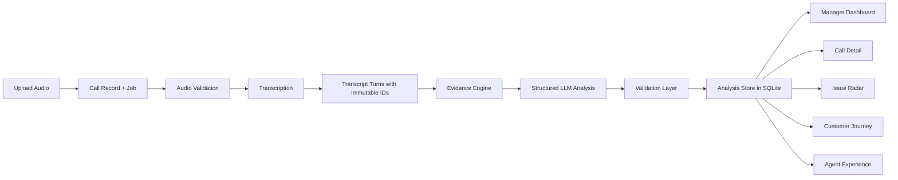
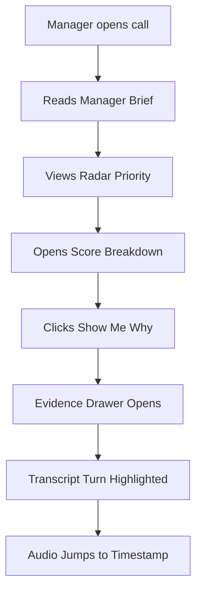
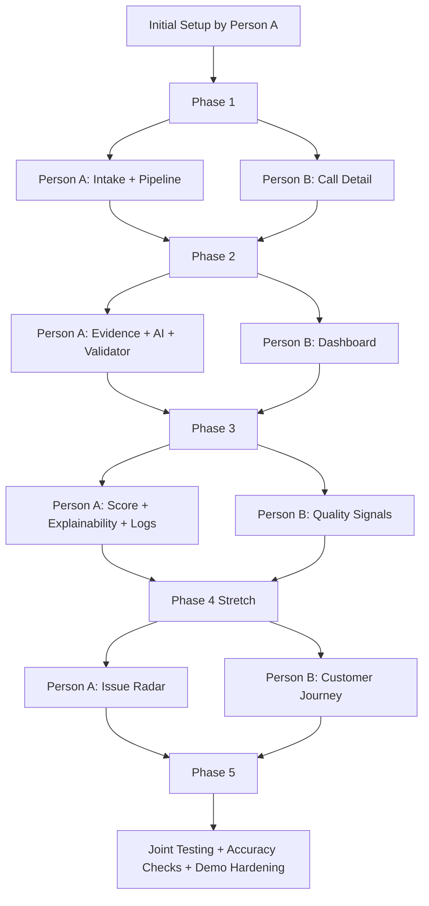
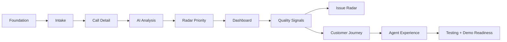

# Architecture and Delivery Plan

## System Architecture

## Call Detail Proof Flow

## Two-Person Delivery Strategy

## Delivery Priority Roadmap

## Epic Backlog

1. Foundation and developer workflow
2. Call intake and processing pipeline
3. Call Detail core experience
4. Evidence-backed AI analysis
5. Radar Priority and Show Me Why
6. Manager dashboard
7. Quality signals
8. Issue Radar
9. Customer Journey
10. Agent experience
11. Observability, testing, and accuracy
12. Demo readiness

## Must-Have POC Scope

The must-have slice for a short POC delivery is:

1. Setup
2. Upload and job pipeline
3. Call Detail with audio/transcript sync
4. Evidence-backed intent, mood, resolution, and summary
5. Manager brief and recommended action
6. Radar Priority and score breakdown
7. Ranked dashboard queue
8. Logs, basic tests, and fallback demo flow

## Definition of Done

Every implementation story should include:

- UI
- API or backend behavior
- Persistence where needed
- Logging
- Tests
- Acceptance checks
- Demo-ready state
